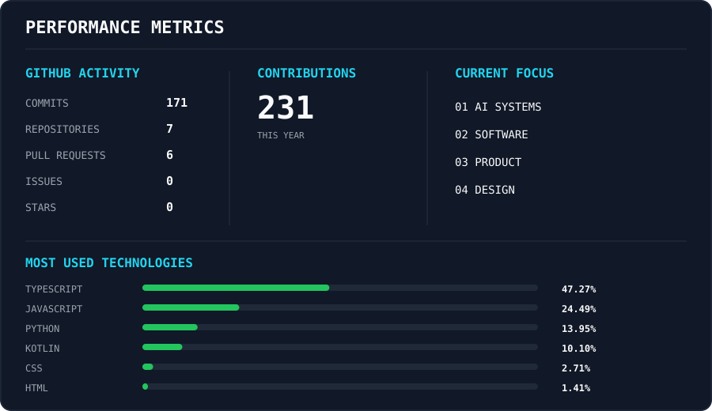

---

<code>who.am.i</code>

### Technology-focused builder & problem solver.

I turn ideas into practical software products by combining **AI, software engineering, and product thinking**.

I enjoy taking problems from **concept → system → interface → working product**.

> Build things that are useful, intelligent, and capable of becoming something bigger.

---

| `my.vision` | `my.mission` |
|:---:|:---:|
| **Build technology that matters.**  Create useful technology that solves real problems and has the potential to become something meaningful. | **Learn → Build → Test → Improve**  Keep learning, build continuously, test ideas quickly, and improve through iteration. |

---

| `what.i.do` | `what.i.value` |
|:---:|:---:|
| **01 — AI SYSTEMS** Building AI-powered systems for practical problems.  **02 — SOFTWARE** Developing functional applications and digital products.  **03 — PRODUCT** Turning ideas into usable products.  **04 — DESIGN** Creating simple, purposeful interfaces. | **01 — CURIOSITY** Keep learning.  **02 — EXECUTION** Turn ideas into reality.  **03 — INNOVATION** Find better approaches.  **04 — GROWTH** Improve continuously.  **05 — IMPACT** Build things that matter. |

---

<code>tech.stack</code>

### LANGUAGES

`JavaScript` `TypeScript` `Python` `C++` `HTML` `CSS`

### FRONTEND

`React` `Next.js` `Tailwind CSS`

### BACKEND

`Node.js` `Express`

### AI / DATA

`Python` `AI/ML` `APIs`

### TOOLS

`Git` `GitHub` `VS Code` `Figma`

---

| `short.term.goals` | `long.term.goals` |
|:---:|:---:|
| Build stronger AI & software projects Improve engineering skills Ship more real-world products Strengthen problem solving | Build high-impact products Become a stronger technology builder Work at the intersection of AI, software & product Create technology that reaches real users |

---

<code>currently.learning</code>

| AI SYSTEMS | SOFTWARE ENGINEERING | PRODUCT & DESIGN |
|:---:|:---:|:---:|
| AI-powered applications Intelligent systems Applied AI | Architecture Backend systems Scalable engineering | Product thinking UI/UX Design systems |

---

<code>performance.metrics</code>

  

---

<code>contribution.snake</code>

  

---

<code>connect</code>

If you're building something interesting, solving a difficult problem, or simply want to talk about technology — let's connect.

  

**GITHUB** • **EMAIL**

---

  

Built with curiosity, code, and a lot of iteration.

