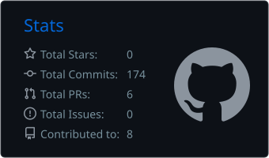
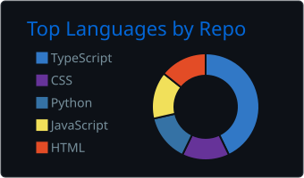

 

  

<h2><code>&gt; who.am.i</code></h2>

<table>
<tr>
<td width="65%" valign="top">

<h3>Technology-focused builder & problem solver.</h3>

I like turning ideas into <b>actual products</b> rather than stopping at concepts.

My interests sit at the intersection of:

<b>AI × SOFTWARE × PRODUCT × DESIGN</b>

I enjoy working across the entire process — from understanding a problem and designing an experience to building the system, integrating AI and shipping a working product.

I'm still figuring out exactly what kind of builder I want to become, but the direction is clear:

<blockquote><b>Build things that are useful, intelligent and capable of becoming something bigger.</b></blockquote>

</td>

<td width="35%" valign="top">

<h3><code>IDENTITY</code></h3>

<pre>
┌───────────────────────┐
│                       │
│  ROLE                 │
│  Technology Builder   │
│                       │
│  FOCUS                │
│  AI                   │
│  Software             │
│  Product              │
│  Design               │
│                       │
│  APPROACH             │
│  Learn → Build        │
│  Test → Improve       │
│                       │
└───────────────────────┘
</pre>

</td>
</tr>
</table>

<table>
<tr>
<td width="50%" valign="top">

<h2><code>&gt; my.vision</code></h2>

<h3>Build technology that matters.</h3>

I want to become a <b>strong technology entrepreneur and product builder</b> capable of taking an idea from zero to a real, scalable product.

I want to build technology that is:

<ul>
<li><b>Useful</b> — solves problems people actually have</li>
<li><b>Intelligent</b> — uses technology and AI meaningfully</li>
<li><b>Well-designed</b> — simple, intuitive and purposeful</li>
<li><b>Scalable</b> — capable of growing beyond a prototype</li>
</ul>

<blockquote>I want to build products that can become something much bigger.</blockquote>

</td>

<td width="50%" valign="top">

<h2><code>&gt; my.mission</code></h2>

<h3>Learn → Build → Test → Improve</h3>

I learn primarily by <b>building</b>.

<pre>
       LEARN
         ↓
       BUILD
         ↓
        TEST
         ↓
      IMPROVE
         ↓
       REPEAT
</pre>

I combine <b>technology, AI, design and problem-solving</b> to turn ideas into working products.

<blockquote>An imperfect working product teaches more than a perfect idea that was never built.</blockquote>

</td>
</tr>
</table>

<table>
<tr>
<td width="50%" valign="top">

<h2><code>&gt; what.i.do</code></h2>

<h3>01 · AI SYSTEMS</h3>

Building applications that use AI for real functionality — not just as a feature added for the sake of it.

<h3>02 · SOFTWARE</h3>

Developing full-stack applications across frontend, backend, APIs and databases.

<h3>03 · PRODUCT</h3>

Turning ideas into usable products — from problem definition and architecture to deployment.

<h3>04 · DESIGN</h3>

Creating interfaces that are intuitive, purposeful and enjoyable to use.

</td>

<td width="50%" valign="top">

<h2><code>&gt; what.i.value</code></h2>

<b>01 · CURIOSITY</b> Keep exploring.

<b>02 · EXECUTION</b> Build instead of just talking.

<b>03 · INNOVATION</b> Look for better solutions.

<b>04 · GROWTH</b> Keep getting better.

<b>05 · IMPACT</b> Build things that matter.

<b>06 · INDEPENDENCE</b> Figure things out and build.

</td>
</tr>
</table>

<h2><code>&gt; tech.stack</code></h2>

<table>
<tr>
<td width="20%"><b>LANGUAGES</b></td>
<td>

</td>
</tr>

<tr>
<td><b>FRONTEND</b></td>
<td>

</td>
</tr>

<tr>
<td><b>BACKEND</b></td>
<td>

</td>
</tr>

<tr>
<td><b>AI / DATA</b></td>
<td>

</td>
</tr>

<tr>
<td><b>TOOLS</b></td>
<td>

</td>
</tr>
</table>

<table>
<tr>
<td width="50%" valign="top">

<h2><code>&gt; short.term.goals</code></h2>

<ul>
<li>Become significantly stronger in <b>AI, software engineering and product development</b>.</li>
<li>Build and ship more serious products beyond basic academic or demo projects.</li>
<li>Improve my <b>UI/UX and product thinking</b>.</li>
<li>Perform strongly in <b>hackathons and technical competitions</b>.</li>
<li>Build a portfolio that demonstrates what I can actually create.</li>
<li>Become more independent at taking an idea from <b>concept → design → development → deployment</b>.</li>
</ul>

</td>

<td width="50%" valign="top">

<h2><code>&gt; long.term.goals</code></h2>

<ul>
<li>Become a <b>high-level product engineer and technology entrepreneur</b>.</li>
<li>Build products that reach and help <b>real users</b>.</li>
<li>Start or lead a <b>technology company/product</b> of my own.</li>
<li>Combine <b>AI + engineering + design</b> to create products with real-world impact.</li>
<li>Move beyond individual projects and eventually build something <b>much bigger</b>.</li>
</ul>

</td>
</tr>
</table>

 

<pre>
┌──────────────────────────────────────────────────────┐
│                                                      │
│              IDEA → PRODUCT → SCALE                  │
│                                                      │
│          BUILDING TOWARDS SOMETHING BIGGER           │
│                                                      │
└──────────────────────────────────────────────────────┘
</pre>

<h2><code>&gt; currently.learning</code></h2>

<table>
<tr>
<td width="33%" valign="top">

<h3>AI SYSTEMS</h3>

Going deeper into <b>AI application development</b>, intelligent workflows, embeddings, memory systems and practical AI integration.

</td>

<td width="33%" valign="top">

<h3>SOFTWARE ENGINEERING</h3>

Strengthening <b>architecture, backend development, APIs, databases and system design</b> to build more robust products.

</td>

<td width="33%" valign="top">

<h3>PRODUCT & DESIGN</h3>

Improving <b>UI/UX, product thinking and user experience</b> so the things I build are not only functional, but genuinely usable.

</td>
</tr>
</table>

 

<pre>
LEARN SOMETHING
      ↓
BUILD WITH IT
      ↓
BREAK IT
      ↓
UNDERSTAND WHY
      ↓
BUILD IT BETTER
</pre>

<h2>📊 Performance Metrics</h2>

  

  

<h2>🐍 Contribution Snake</h2>

  

<h2><code>&gt; connect</code></h2>

If you're building something interesting, solving a difficult problem, or simply want to talk about technology — let's connect.

  

<pre>
┌──────────────────────────────────────────────────────┐
│                                                      │
│              BUILD • SHIP • ITERATE                 │
│                                                      │
│                 KEEP BUILDING.                       │
│                                                      │
└──────────────────────────────────────────────────────┘
</pre>

Built with curiosity, code and a lot of iteration.

 

